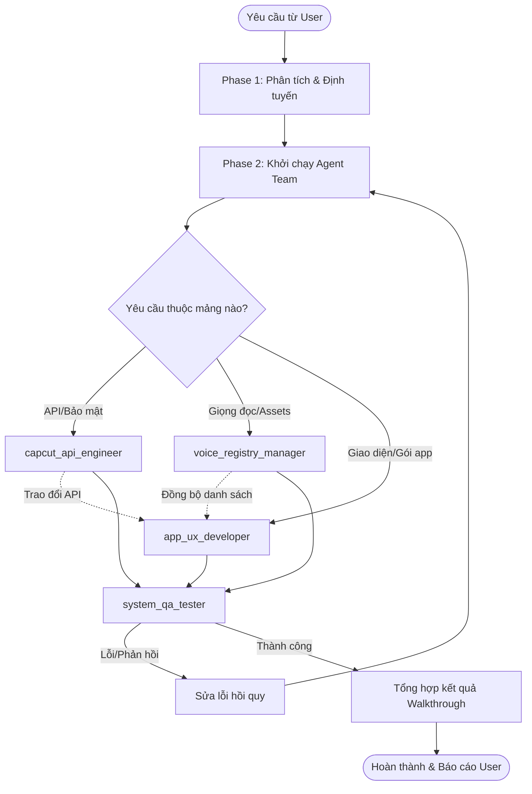

# Orchestrator: CapCut Studio Orchestrator

Kỹ năng điều phối này quản lý sự phối hợp của đội ngũ tác nhân AI chuyên biệt để giải quyết các tác vụ phức tạp trong dự án.

---

## 1. Chế độ chạy (Run Mode)
- **Chế độ mặc định**: **Agent Team (Phối hợp nhóm)**.
- Khi được kích hoạt, Orchestrator sẽ gọi đồng thời các tác nhân chuyên biệt. Các tác nhân này sẽ hoạt động độc lập và trực tiếp thảo luận với nhau thông qua `send_message` và chia sẻ dữ liệu qua thư mục làm việc chung.

---

## 2. Quy trình điều phối (Coordination Flow)



### Phase 1: Phân tích & Định tuyến
1. Nhận diện mục tiêu của người dùng (Ví dụ: Thêm giọng đọc mới, cập nhật UI, sửa lỗi chữ ký mạng).
2. Xác định các tác nhân cần tham gia vào luồng xử lý.

### Phase 2: Khởi chạy Agent Team (Dispatch)
Khởi chạy subagent bằng công cụ `invoke_subagent`.
*Ví dụ câu lệnh khởi chạy nhóm:*
```json
{
  "Subagents": [
    {
      "TypeName": "capcut_api_engineer",
      "Role": "API Security Maintenance",
      "Prompt": "Kiểm tra cấu trúc request ký sign hiện tại, cập nhật thuật toán MD5 x-ss-stub nếu có sai lệch."
    },
    {
      "TypeName": "system_qa_tester",
      "Role": "Integration Tester",
      "Prompt": "Hỗ trợ API engineer chạy test hồi quy các API endpoints."
    }
  ]
}
```

### Phase 3: Trao đổi dữ liệu và thực thi
- Các tác nhân thảo luận trực tiếp qua `send_message` (ví dụ: QA Tester gửi log lỗi cho API Engineer).
- Các file cấu trúc dữ liệu lớn được lưu tại thư mục tạm để chia sẻ.

### Phase 4: Kiểm định và Bàn giao (Quality Gate)
- `system_qa_tester` thực hiện kiểm thử tự động toàn bộ API và giao diện tĩnh.
- Ghi nhận báo cáo test thành công trước khi kết thúc phiên.

---

## 3. Kịch bản kiểm thử (Test Scenarios)

### Happy Path (Kịch bản thành công)
1. User yêu cầu thêm giọng đọc tiếng Anh mới.
2. `voice_registry_manager` thu thập thông tin và cập nhật `Voice.json`.
3. `system_qa_tester` chạy script kiểm tra API tạo tiếng với giọng đọc mới đó thành công.
4. `app_ux_developer` cập nhật bộ lọc ngôn ngữ của giao diện.
5. Kiểm thử thành công ➡️ Bàn giao kết quả cho User.

### Error Path (Kịch bản sửa lỗi)
1. User báo lỗi tạo giọng nói TTS thất bại (`sign-error`).
2. `system_qa_tester` được gọi để chạy test và ghi nhận mã lỗi `403 Forbidden` cùng gói tin bị lỗi chữ ký.
3. `system_qa_tester` gửi tin nhắn kèm mã lỗi cho `capcut_api_engineer`.
4. `capcut_api_engineer` cập nhật cấu trúc salt hash trong `make_sign_header`.
5. Chạy lại test thành công ➡️ Khởi động lại server ➡️ Hoàn tất sửa lỗi.
